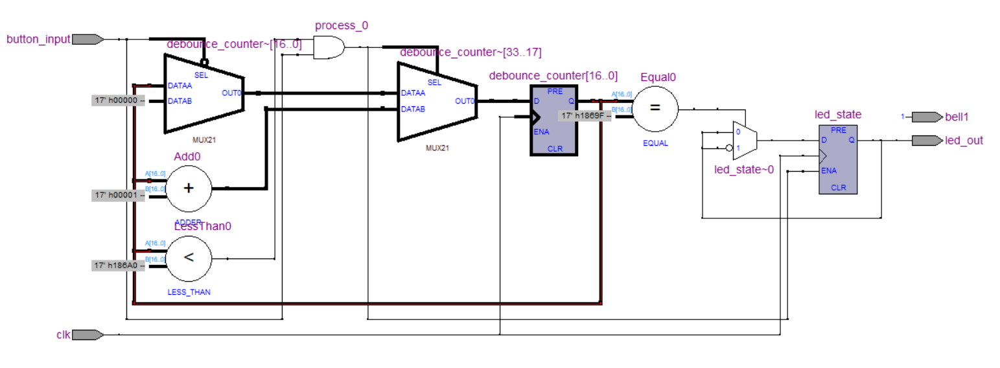
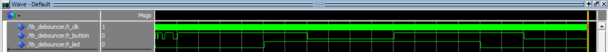

# Button Debouncer & Toggle (VHDL)

VHDL project implemented on a legacy **Altera Cyclone I** board.
It filters the mechanical noise from the push-buttons and uses the clean signal to toggle an LED (ON/OFF).

## Project Details
The raw signal from the button is too noisy for reliable switching. I implemented a counter-based filter to ignore glitches.

* **Board:** Altera Cyclone I
* **Clock:** 50 MHz
* **Filter Logic:** The signal must be stable for **2ms** (100,000 clock cycles) to be registered.
* **Output:** The LED toggles state only on a clean rising edge.

## RTL Schematic
Generated with Quartus II 9.2. It shows the counter, comparators, and the state register.

## Verification (ModelSim)
I wrote a VHDL testbench (`tb_debouncer.vhd`) to simulate a noisy environment.

* **Test Section 1:** Injected micro-second glitches -> **Output stays low (Correct).**
* **Test Section 2:** Stable press > 2ms -> **Output toggles High.**
* **Test Section 3:** Second stable press -> **Output toggles Low.**

*Simulation showing noise rejection and clean toggling.*

## Folder Structure
* `src/`: Source code (VHDL).
* `tb/`: Testbench file.
* `docs/`: Images and schematics.

---
*Alejandro Mañas - GREELEC (UPC)*
